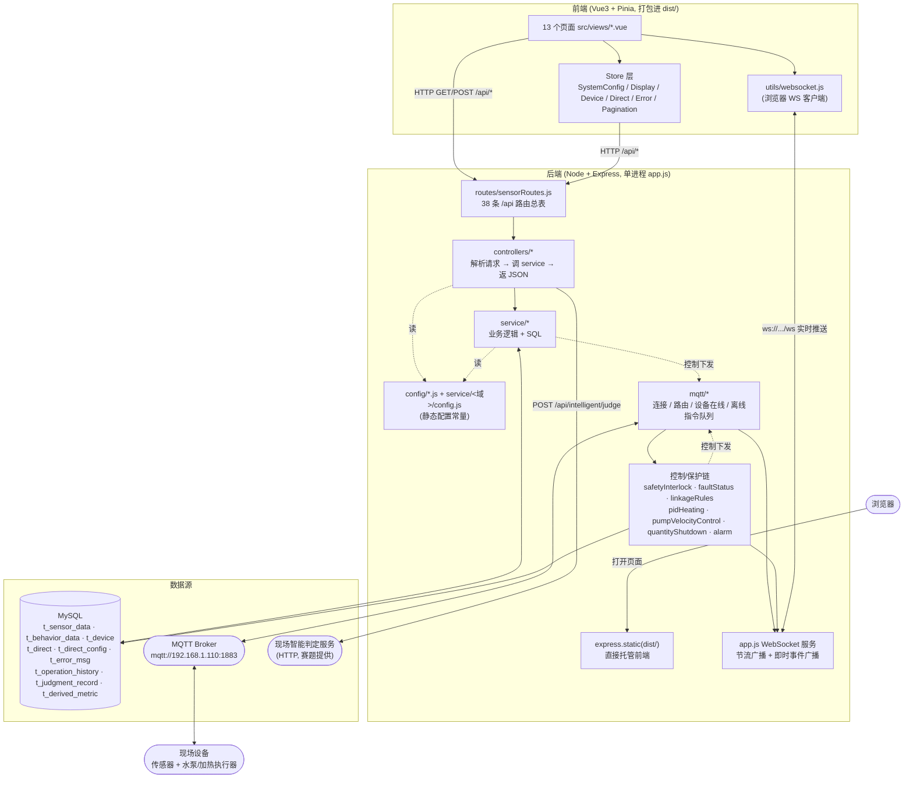
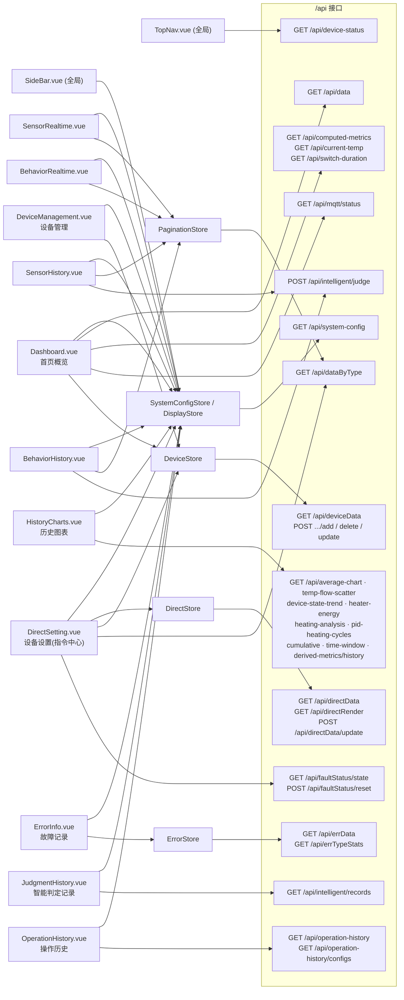
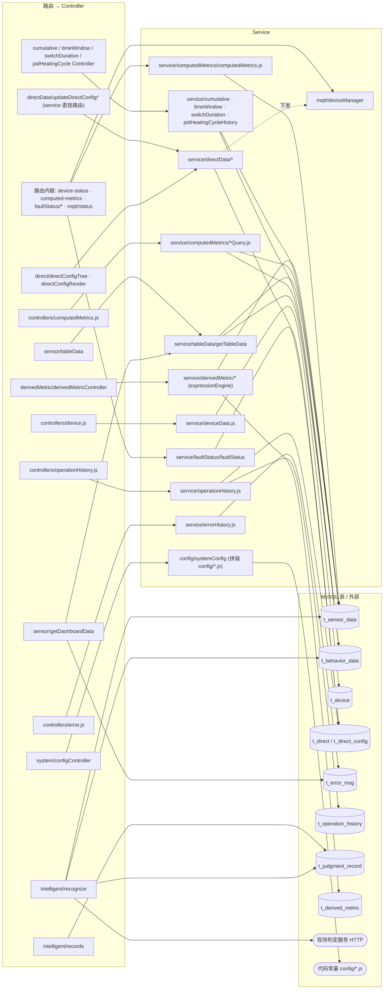
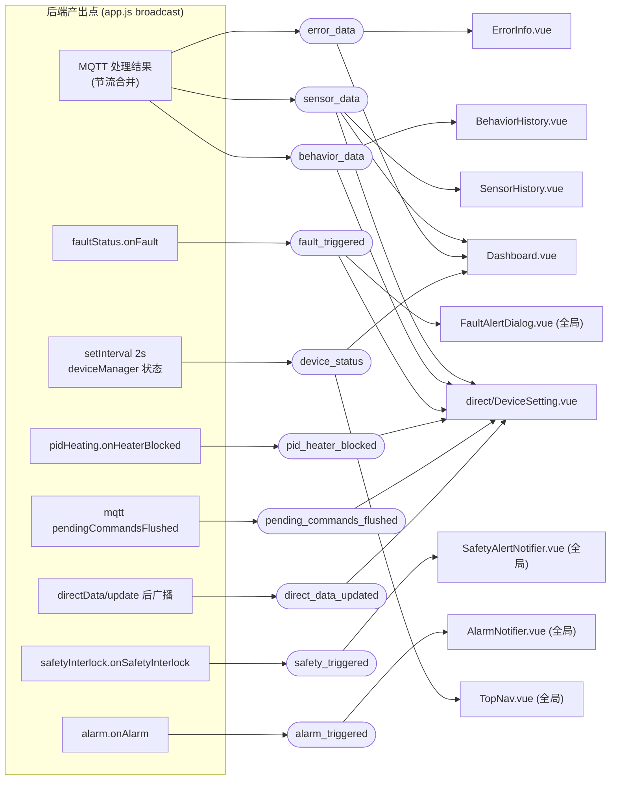

# 项目总架构

**lot-sensor-pc** —— 生物物联网竞赛用的水循环系统监控平台。
前端 Vue3 + Pinia（打包进 `dist/`），后端 Node + Express 单进程（`backend/server/app.js`），
数据存 MySQL，与现场设备走 MQTT，浏览器实时数据走 WebSocket。

> 后端内部结构见 `backend/server/ARCHITECTURE.md`；配置项速查见 `backend/server/CONFIG_CHEATSHEET.md`。
> 下面的图用 mermaid，贴到 <https://mermaid.live> 或 VSCode 的 Markdown Preview Mermaid 插件里看。

---

## 图 1 · 全景分层

---

## 图 2 · 前端页面 / Store ↔ 后端 HTTP 接口

---

## 图 3 · 接口 → Controller → Service → 数据表

---

## 图 4 · WebSocket 实时推送（后端产出 → 前端订阅）

---

## 要点

- **所有页面**都经 `SystemConfigStore` / `DisplayStore` 读一次 `GET /api/system-config`（标题 / 术语 / 单设备模式 / 字段显隐）——这是唯一一个"所有页面都依赖"的接口。配置本身是后端代码常量（`config/*.js`），此接口只读不写。
- `DirectSetting.vue`（设备设置页）是最重的页面：经 `DirectStore` 读写指令中心 `t_direct`，又直接订阅 6 种 WebSocket 消息。
- 后端有 4 个接口不经 controller 文件，直接内联在 `routes/sensorRoutes.js` 里：`/api/device-status`、`/api/computed-metrics`、`/api/faultStatus/state`、`/api/faultStatus/reset`。
- **两条控制路径**：① 页面通过 `POST /api/directData/update` 手动下发；② MQTT 每来一条上报，控制/保护链（safetyInterlock / faultStatus / linkageRules / pidHeating / pumpVelocityControl / quantityShutdown / alarm）自动评估，命中就写 `t_direct` + MQTT 下发 + 记录到 `t_error_msg` / `t_operation_history`。
- `t_direct`（指令中心，"设备设置"页可调）是各阈值/开关**真正生效**的层；`config/*.js` 里的同名项只是删掉指令项时的兜底默认值。
