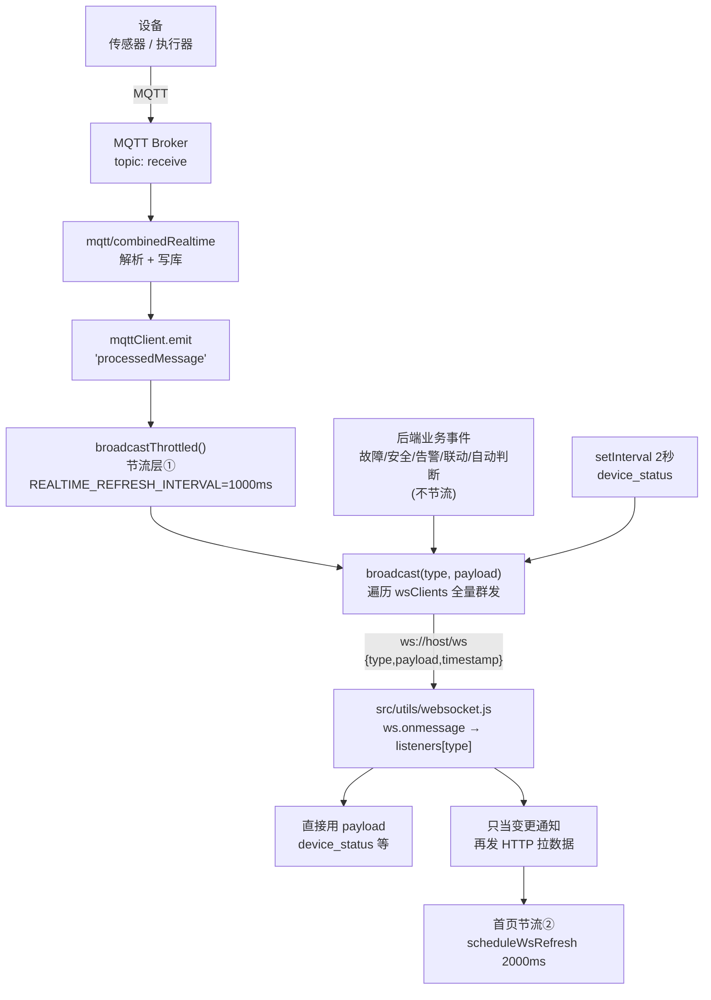
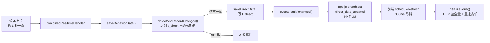

# WebSocket 实时推送链路

> 浏览器实时数据这条线怎么走、哪里有坑、想给一个页面加实时刷新该怎么做。
> 后端 WS 服务端在 `backend/server/app.js`，浏览器端在 `src/utils/websocket.js`。
> 图用 mermaid，贴到 <https://mermaid.live> 或 VSCode 的 Markdown Preview Mermaid 插件里看。

---

## 一、全景



一句话概括：**设备数据走 MQTT 进后端，后端处理完用 WebSocket 通知浏览器，浏览器大多不用推送里的数据、而是转头再发 HTTP 把数据查一遍。**

---

## 二、连接是怎么建起来的

### 浏览器侧 `src/utils/websocket.js`

```js
const url = options.url || `${getWebSocketBaseUrl()}/ws`
ws = new WebSocket(url)
```

- 地址由 `utils/runtimeEndpoint` 按本地/远程模式动态拼，不写死。
- `connect()` 开头有 `readyState` 检查，重复调用会跳过。`ws` / `listeners` 都是**模块级单例**，所以无论多少个页面调 `connect()`，全站只有**一条物理连接**。

### 后端侧 `backend/server/app.js`

```js
const wss = new WebSocketServer({ server, path: '/ws' });
```

和 HTTP **共用同一个 `http.Server`**，同一个端口，路径 `/ws`。

建连时两道校验：

| 校验 | 说明 | 不通过 |
|---|---|---|
| Origin 白名单 | 防恶意网页跨站连入 | `close(1008, '来源不允许')` |
| API_TOKEN | 配了才校验，从 URL query 取 `?token=xxx`（WS 不能带自定义 header） | `close(1008, '未授权')` |

通过后 `wsClients.add(ws)`，并**立刻单独给这一个客户端推一帧 `device_status`**，不用等下一轮 2 秒定时广播——这样头部导航的设备在线状态能马上有值。注意它前面有 `await mqttClient.waitForDeviceSync()`，要等设备表从数据库同步完。

---

## 三、三种心跳，别搞混

| 心跳 | 方向 | 周期 | 作用 | 代码 |
|---|---|---|---|---|
| **WebSocket ping/pong** | 浏览器 → 后端 | 15s | 保持 WS 连接不被中间代理判空闲掐断 | `websocket.js` `startHeartbeat()` / `app.js` `ws.on('message')` |
| 设备心跳 | 设备 → 后端 (MQTT) | 设备定 | 判设备在线/离线 | `mqtt/index.js`、`mqtt/deviceManager.js` |
| PC 心跳 | 后端 → 设备 (MQTT) | 1s | 让设备知道上位机活着，否则设备自己缓存数据等补传 | `mqtt/pcHeartbeat.js` |

**只有第一种属于本文档的范围。** 它是纯应用层的：前端每 15 秒 `send({type:'ping'})`，后端回 `{type:'pong'}`。

⚠️ **前端收到 pong 后什么也不做**——没有注册 `pong` 的 listener，也没有超时检测。所以这个心跳只起"产生流量防止被掐断"的作用，**不能用于探测连接是否真的死了**。真正的断线检测靠浏览器自己触发 `onclose`。

---

## 四、消息的三个源头

### 源头 1 · MQTT 上报（唯一会被节流的）

`app.js` 里：

```js
mqttClient.on('processedMessage', (topic, data) => {
    // 传感器和行为配成同一个主题时，一条数据广播成两种类型
    if (topics.sensor === topics.behavior && topic === topics.sensor) {
        broadcastThrottled('sensor_data', data)
        broadcastThrottled('behavior_data', data)
        return
    }
    ...
})
```

本项目设备把传感器字段和行为字段放在**同一条消息**里上报（`config/mqtt.js` 里 `sensor` 和 `behavior` 都是 `'receive'`），所以这里**同一条数据被广播成两种类型**，让"传感器实时页"和"行为实时页"各自都收得到。

### 源头 2 · 后端业务事件（不节流，立即推）

全是后端自己算出来的判断结果（设备侧已不再上报告警）：

`fault_triggered`、`safety_triggered`、`alarm_triggered`、`linkage_triggered`、`spike_triggered`、`relay_stuck_triggered`、`sensor_inverted_triggered`、`pid_heater_blocked`、`auto_judgment`、`pending_commands_flushed`、`direct_data_updated`

这些走的是**事件回调模式**（重要，新增推送时要照着抄）：service 层用 EventEmitter 发事件 → app.js 监听 → broadcast。例如 `service/directData/saveDirectConfig.js`：

```js
events.emit('changed', { config_id, value, d_no: finalDNo })
module.exports = { ..., onDirectDataChanged: (listener) => events.on('changed', listener) }
```

app.js：

```js
onDirectDataChanged((payload) => { broadcast('direct_data_updated', payload); });
```

### 源头 3 · 定时器

```js
setInterval(() => {
    broadcast('device_status', mqttClient.getAllDeviceStatus());
}, 2000);
```

---

## 五、两层节流

### 后端节流 `broadcastThrottled()` · app.js

只对 `sensor_data`、`behavior_data`、`error_data` 三种类型生效（`THROTTLED_TYPES`），间隔取 `REALTIME_REFRESH_INTERVAL`，当前值 **1000ms**（`config/appSettings.js`）。配成 `0` 则完全不节流。

算法**不是**"收到消息后等满一个间隔再推"，而是按**距上次广播过了多久**算：

```js
const wait = Math.max(0, interval - (Date.now() - (lastBroadcastAt[type] || 0)))
```

为什么这么设计：设备按 1 秒上报时，到达间隔会在 1 秒上下抖动。固定等满 1 秒的话，两条消息很容易落进同一个窗口、前一条被后一条覆盖，页面就少一帧（实测 20 秒丢 3 帧、页面停 2 秒才动），而且每条都白白晚 1 秒才推。按"距上次多久"算：已满一个间隔就立刻推，没满只等剩下那点时间。**上报频率不超过节流间隔时一条都不丢**，超了才合并推最新一条。

窗口期内的数据存在 `throttleCache[type]`，只保留最新一条。

### 前端节流 `scheduleWsRefresh()` · Dashboard.vue

**只有首页有**，间隔 2000ms，策略是"首次立即 + 窗口内合并 + 窗口末尾补刷"：

```js
function scheduleWsRefresh() {
  if (wsRefreshTimer) { wsRefreshPending = true; return }
  loadDashboard(false)
  wsRefreshTimer = setTimeout(() => {
    wsRefreshTimer = null
    if (wsRefreshPending) { wsRefreshPending = false; scheduleWsRefresh() }
  }, WS_REFRESH_INTERVAL_MS)
}
```

加它的原因：首页一次 `loadDashboard()` 要打 5~6 个 HTTP 接口，而设备每秒上报一条，不节流就是**每秒 5~6 个请求**压在后端和 MySQL 上（连接池只有 10 个连接）。

### 叠加后的实际效果

```
设备 1秒1条 → 后端节流(1000ms) → 浏览器收到 1秒1条
                                  ├→ 首页：节流(2000ms) → 每2秒刷新 → 每次 5~6 个 HTTP 请求
                                  └→ 实时页：无节流 → 每秒 reloadData() 一次
```

---

## 六、消息类型总表

| type | 触发源 | 节流 | 订阅方 | 收到后做什么 |
|---|---|---|---|---|
| `sensor_data` | MQTT 上报 | ✅1s | `Dashboard.vue`、`SensorRealtime.vue`、`direct/DeviceSetting.vue` | 前两者**丢弃 payload** 重发 HTTP；指令页只取 `payload._pidHeating`（直接用，正面示范） |
| `behavior_data` | MQTT 上报 | ✅1s | `BehaviorRealtime.vue` | 同上 |
| `device_status` | 建连首帧 + 每2秒 | ❌ | `Dashboard.vue` | **直接用 payload**（正面示范） |
| `direct_data_updated` | 指令值任何变化 | ❌ | `components/direct/DeviceSetting.vue` | 刷新指令页 |
| `fault_triggered` | 故障状态机 | ❌ | `components/FaultAlertDialog.vue`、`direct/DeviceSetting.vue` | 弹故障对话框 / 指令页立即拉权威故障状态 |
| `safety_triggered` | 安全联锁 | ❌ | `components/SafetyAlertNotifier.vue` | 弹安全告警 |
| `alarm_triggered` | 告警规则 | ❌ | `components/AlarmNotifier.vue` | 弹告警通知 |
| `spike_triggered` | 毛刺检测 | ❌ | `components/AlarmNotifier.vue` | 同上 |
| `relay_stuck_triggered` | 继电器粘连检测 | ❌ | `components/AlarmNotifier.vue` | 同上 |
| `sensor_inverted_triggered` | 传感器装反检测 | ❌ | `components/AlarmNotifier.vue` | 同上 |
| `linkage_triggered` | 联动规则 | ❌ | `components/LinkageNotifier.vue` | 弹联动提示 |
| `auto_judgment` | 自动判断 | ❌ | `views/AutoJudgment.vue` | 追加一条记录 |
| `pending_commands_flushed` | 暂存指令下发完 | ❌ | `components/direct/DeviceSetting.vue` | 重建表单 + 提示"缓存指令已发送" |
| `pid_heater_blocked` | PID 加热被拦截 | ❌ | `components/direct/DeviceSetting.vue` | 提示加热被拦截 |
| `error_data` | **无人广播** ⚠️ | ✅1s | `Dashboard.vue`、`views/ErrorInfo.vue` | 见问题 1 |

---

## 七、断线重连

**浏览器侧**：`onclose` 后固定 **3 秒**重连一次，无限重试，无退避。`isManualClose`（主动调 `close()`）时不重连。

`close()` **不清空 `listeners`**——这是对的，重连后所有页面的订阅继续有效，不用重新注册。

**重连后**会重新触发后端 `wss.on('connection')`，所以会立刻收到一帧 `device_status`。

⚠️ **断线期间错过的消息彻底丢失，没有补发机制。** 对 `sensor_data` 没影响（下一秒就有新的），但 `fault_triggered` 这类**一次性事件**，断线期间触发的就永久错过了（见问题 5）。

---

## 八、已知问题与修复方案

### 问题 1 · `error_data` 是条死链路 🔴

**现象**：`error_data` 在后端**从来没有被任何地方 broadcast 过**。全项目它只出现在四处：

```
app.js   —— JSDoc 注释里举例
app.js   —— THROTTLED_TYPES 集合里列着（但没人往里发）
Dashboard.vue      —— 订阅
views/ErrorInfo.vue —— 订阅
```

`app.set('wsBroadcast', broadcast)` 虽然导出了广播函数，但**全项目没有任何模块 `app.get('wsBroadcast')` 取用过**。

**影响**：`ErrorInfo.vue`（故障记录页）指望靠它做实时刷新，实际上永远不触发，**那个页面不会自动更新**，必须手动刷新才能看到新故障。

**成因推测**：`mqtt/index.js` 文件头写着"原本还订阅设备主动上报的 alarm 告警主题，现赛题场景不再有设备侧上报告警，该子模块已删除"。`error_data` 大概是那次删掉的，前端订阅留了下来。

**修复方案**（照抄项目现有的事件回调模式，改动最小）：

所有故障/告警写 `t_error_msg` 都走 `service/controlShared/recordEvent.js`（安全联锁、故障状态机、联动规则、毛刺、继电器粘连、传感器装反 6 个服务都调它），在这里 emit 即可。

第一步，改 `service/controlShared/recordEvent.js`：

```js
const EventEmitter = require('events')
const events = new EventEmitter()

async function recordEvent({ deviceNo, message, code, type, time }) {
  const cTime = time || nowLocalDateTime()
  await promisePool.execute(
    'INSERT INTO t_error_msg (d_no, c_time, e_msg, e_no, type) VALUES (?, ?, ?, ?, ?)',
    [deviceNo || null, cTime, message, code ?? null, type]
  )
  // 写库成功后才通知，避免页面刷出一条数据库里还不存在的记录
  events.emit('recorded', { deviceNo: deviceNo || null, message, code: code ?? null, type, time: cTime })
}

module.exports = {
  recordEvent,
  onEventRecorded: (listener) => events.on('recorded', listener),
}
```

第二步，在 `app.js` 里监听（放在其它 `onXxx` 监听旁边）：

```js
const { onEventRecorded } = require('./service/controlShared/recordEvent');

// 故障/告警入库后通知故障记录页刷新。走节流（THROTTLED_TYPES 里已有 error_data），
// 避免同一时刻批量触发多条告警时页面连续重查。
onEventRecorded((payload) => {
    broadcastThrottled('error_data', payload);
});
```

**注意**：`service/alarm/evaluateRules.js` 里还有一条**自己手写的** `INSERT INTO t_error_msg`，没走 `recordEvent`。要么把它也改成调 `recordEvent`（推荐，顺手消掉一份重复代码），要么它那里单独 emit 一次，否则告警规则触发的记录不会推送。

---

### 问题 2 · 指令页收到推送后全量重建表单 🟠

**现象**：`direct_data_updated` 的 payload 里**已经带了变化的具体字段**：

```js
events.emit('changed', { config_id, value, d_no: finalDNo })
```

但 `components/direct/DeviceSetting.vue` 收到后只是 `scheduleRefresh()`，走 300ms 防抖再调 `initializeForm()`——那个函数会 `await prop.handleRender(prop.id)` 发 HTTP 重新拉全量，然后 `Object.keys(formData).forEach(key => delete formData[key])` 把整个表单清空重建，再等两轮 `nextTick`。

**影响**：一个开关的变化，要付出「300ms 防抖 + 一次 HTTP 往返 + 全量表单重建」的代价。这也是指令页反映设备状态"不够快"的主要来源（详见第十一节）。

**修复方向**：单字段变化走局部更新快路径，全局/复位变化才回退到全量刷新。见第十一节的方案 A。

---

### 问题 3 · 全量广播，没有任何过滤 🟡

`broadcast()` 无差别遍历 `wsClients` 群发。开 5 个页面，每条 `sensor_data` 就发 5 份；每个页面都会收到跟自己完全无关的所有类型。

单设备、少页面时无所谓，但这是个**不随设备数扩展**的设计：以后多设备时，每个客户端都会收到全部设备的消息，前端得自己过滤。

**修复方向**（当前规模下不急）：建连时让客户端发一条 `{type:'subscribe', types:[...], deviceNo:'xxx'}`，后端把订阅信息挂在 `ws` 对象上，`broadcast` 时按需过滤。

---

### 问题 4 · 推送带着数据，前端却丢掉不用 🟠

**这是首页请求风暴的根因。** 后端 `broadcast('sensor_data', data)` 里的 `data` 就是刚解析好的那条传感器数据，但三个订阅方全部写成：

```js
wsOn('sensor_data', () => reloadData(true))        // SensorRealtime.vue
wsOn('sensor_data', () => scheduleWsRefresh())     // Dashboard.vue
wsOn('behavior_data', reloadData)                  // BehaviorRealtime.vue
```

payload 直接扔掉，转头再发 HTTP 去数据库把同一份数据查一遍。

`device_status` 是正面例子——`Dashboard.vue` 里直接 `deviceStatuses.value = payload`，零额外请求。

**修复**：见第九节"场景 C"。首页那 5~6 个请求里，`/api/computed-metrics` 和 `/api/current-temp` 是最容易省掉的——计算指标本来就在后端内存里（`service/computedMetrics/computedMetrics.js` 的 `getLatest()`），顺手挂在推送体上即可。

---

### 问题 5 · 断线期间的一次性事件永久丢失 🟠

告警/故障这类事件没有补发或序号补偿。浏览器断线 3 秒重连，这期间触发的 `fault_triggered` 就再也收不到了。

**修复方向**：事件带递增序号（或直接用 `t_error_msg.id`），前端记下收到的最后一个 id，重连后（在 `onOpen` 回调里）用 HTTP 补拉"该 id 之后的事件"。故障告警本来就有落库，补拉是现成可做的。

---

### 问题 6 · WS 心跳不检测连接存活 🟢

如第三节所述，前端发 ping、后端回 pong，但前端不处理 pong、也没有超时判定。

**修复**（可选）：在 `websocket.js` 里记录 `lastPongAt`，`startHeartbeat` 里检查"超过 N 个周期没收到 pong 就主动 `ws.close()` 触发重连"。当前靠浏览器自身的 `onclose` 也能工作，优先级不高。

---

## 九、操作指南：给一个页面新增实时刷新

### 场景 A · 用已有的推送类型（最常见）

比如想让某个页面在设备状态变化时刷新。

**1. 引入并连接**

```js
import { connect, on as wsOn } from '@/utils/websocket'
```

**2. 声明取消订阅的句柄**（放在 `<script setup>` 顶层，不要放 `onMounted` 里面）

```js
let unsubscribeXxx = null
```

**3. 在 `onMounted` 里连接并订阅**

```js
onMounted(async () => {
  await loadData()        // 先把首屏数据加载出来
  connect()               // 幂等，重复调用会跳过
  unsubscribeXxx = wsOn('device_status', (payload) => {
    // payload 就是后端 broadcast 的第二个参数
    deviceStatuses.value = payload
  })
})
```

**4. 在 `onUnmounted` 里取消订阅** ⚠️ **这步不能漏**

```js
onUnmounted(() => {
  unsubscribeXxx?.()
})
```

`listeners` 是模块级全局对象，不取消的话：页面切走了回调还在，会一直跑；来回切几次就注册了好几份，同一条推送触发多次刷新。

**5. 判断要不要加节流**

| 情况 | 处理 |
|---|---|
| 回调里只是给 ref 赋值 | 不用节流 |
| 回调里要发 HTTP 请求，且推送是高频类型（`sensor_data` / `behavior_data`） | **加节流**，照抄 `Dashboard.vue` 的 `scheduleWsRefresh()` |
| 推送是低频事件（各种 `*_triggered`） | 不用节流 |

节流模板（连同 `onUnmounted` 里的 `clearTimeout` 一起抄）：

```js
let wsRefreshTimer = null
let wsRefreshPending = false
const WS_REFRESH_INTERVAL_MS = 2000

function scheduleWsRefresh() {
  if (wsRefreshTimer) { wsRefreshPending = true; return }
  loadData(false)
  wsRefreshTimer = setTimeout(() => {
    wsRefreshTimer = null
    if (wsRefreshPending) { wsRefreshPending = false; scheduleWsRefresh() }
  }, WS_REFRESH_INTERVAL_MS)
}

onUnmounted(() => {
  unsubscribeXxx?.()
  if (wsRefreshTimer) { clearTimeout(wsRefreshTimer); wsRefreshTimer = null }
})
```

---

### 场景 B · 新增一个全新的推送类型

比如想在"某个新的业务事件发生时"通知页面。**照抄 `direct_data_updated` 的事件回调模式**，一共三步。

**1. service 层：发事件**

在产生这个业务动作的 service 文件里：

```js
const EventEmitter = require('events')
const events = new EventEmitter()

async function doSomething(...) {
  // ... 原有逻辑，先把库写完
  await promisePool.query(...)
  // 写库成功后再通知，避免页面刷出数据库里还没有的数据
  events.emit('changed', { /* 页面需要的字段 */ })
}

module.exports = {
  doSomething,
  onSomethingChanged: (listener) => events.on('changed', listener),
}
```

**2. app.js：监听并广播**

放在其它 `onXxx(...)` 监听旁边（`broadcast` 函数定义之后）：

```js
const { onSomethingChanged } = require('./service/xxx/xxx');

onSomethingChanged((payload) => {
    broadcast('something_changed', payload);
});
```

要不要节流？**低频事件用 `broadcast`，跟着设备上报走的高频数据用 `broadcastThrottled`**，后者还需要把类型名加进 `THROTTLED_TYPES`：

```js
const THROTTLED_TYPES = new Set(['sensor_data', 'behavior_data', 'error_data', 'something_changed'])
```

**3. 前端：按场景 A 订阅**

```js
unsubscribeSomething = wsOn('something_changed', (payload) => { ... })
```

**命名约定**（跟现有保持一致）：小写下划线。数据类用 `xxx_data`，事件类用 `xxx_triggered`，状态更新类用 `xxx_updated` / `xxx_changed`。

---

### 场景 C · 让推送直接带数据，省掉 HTTP 回拉（推荐）

这是性能最好的写法，也是修问题 4 的方向。适用于"页面要的数据后端此刻就有"的情况。

**后端**：把数据挂在 payload 上。以首页计算指标为例，`app.js` 里：

```js
const { getLatest: getLatestComputed } = require('./service/computedMetrics/computedMetrics');

mqttClient.on('processedMessage', (topic, data) => {
    // ... 原有的 broadcastThrottled('sensor_data', data)
    // 计算指标本来就在内存里，顺手带上，前端就不用再请求 /api/computed-metrics
    broadcastThrottled('computed_metrics', getLatestComputed())
})
```

**前端**：直接用，不再发请求。

```js
unsubscribeComputed = wsOn('computed_metrics', (payload) => {
  computedMetrics.value = payload || {}
})
```

**判断准则**：

| payload 该带什么 | 理由 |
|---|---|
| 后端内存里现成的（`getLatest()`、`getAllDeviceStatus()`） | 零成本，必须带 |
| 刚写完库、手里就有的那条记录 | 零成本，带上 |
| 需要重新查库、分页、聚合的 | **不要带**，让前端按需请求；推送只当通知 |

---

## 十、排查手册

| 症状 | 先查什么 |
|---|---|
| 页面完全不实时刷新 | 浏览器 Console 有没有 `[WebSocket] 连接已建立`；Network → WS 标签看有没有 `/ws` 连接和消息帧 |
| WS 连不上、被立刻关闭 | 后端日志 `[WebSocket] 拒绝非法来源连接` → Origin 白名单；`拒绝未授权连接` → API_TOKEN 没带 |
| 某个类型收不到 | 用第六节的表确认这个 type **后端真的在推**（`error_data` 就是典型的没人推） |
| 页面刷新但数据是旧的 | 检查回调里是不是又发 HTTP 去查库，而库里还没写完（事件应在**写库成功后**再 emit） |
| 页面刷新过于频繁/卡顿 | 看是不是高频类型没加前端节流（场景 A 第 5 步） |
| 切走再切回来，刷新触发多次 | `onUnmounted` 里漏了取消订阅 |
| 断线重连后丢了告警 | 已知问题 5，目前无补发机制 |
| 后端推了但所有页面都没反应 | `wsClients` 是否为空（没有浏览器连着）；`broadcast` 只发给 `readyState === 1` 的客户端 |

**手动验证推送是否工作**：浏览器 Console 里执行

```js
// 监听所有类型，'*' 会收到完整的 {type, payload, timestamp}
const off = (await import('/src/utils/websocket.js')).on('*', (msg) => console.log('WS:', msg.type, msg.payload))
// 看够了就 off()
```

（生产包里路径不同，开发模式 `npm run dev` 下可用。）

---

## 十一、专题：指令页的实时性

指令页（`views/DirectSetting.vue` + `components/direct/DeviceSetting.vue`）是全站订阅最多的页面，一共 5 种推送 + 1 个轮询兜底。

### 它订阅了什么

| 推送 | 收到后做什么 | 是否直接用 payload |
|---|---|---|
| `direct_data_updated` | `scheduleRefresh()` → 300ms 防抖 → 全量重建表单 | ❌ 丢弃 |
| `pending_commands_flushed` | 重建表单 + 提示"缓存指令已发送" | 仅用于判断是不是本设备 |
| `sensor_data` | 取 `payload._pidHeating` 更新 PID 状态 | ✅ **正面示范** |
| `pid_heater_blocked` | 提示加热被拦截 | ✅ |
| `fault_triggered` | 立即 `loadFaultState()` 拉权威故障状态 | ❌（故意的，要拉权威值） |
| — | `setInterval(loadFaultState, 5000)` 兜底轮询 | — |

它的防抖做得很细致，值得保留：`scheduleRefresh()` 会先判断 `isEditingInput()`，**用户正在输入框里敲字时不刷新**（否则 `initializeForm` 整体重置 `formData` 会把没保存的输入冲掉），先记下"欠一次刷新"，等 `focusout` 后再补。

### 设备状态是怎么走到指令页上的



**关键认知：指令页显示的是 `t_direct`（指令值 / 最后已知值），不是设备的实时反馈值。**

- 你手动下发一个开关时，后端 `saveDirectData` 写库后**立刻**就 emit 了，页面马上变——**这时设备可能还没执行，甚至根本没收到**。
- 设备实际状态要等设备上报回来、且 `detectAndRecordChanges` 发现"与预期不一致"时，才会再推一次把页面纠正过来。
- 如果设备上报的值与 `t_direct` **一致**，不会发任何事件（这是对的，只推变化）。

### 延迟构成

| 环节 | 耗时 | 能不能优化 |
|---|---|---|
| 设备上报周期 | ~1 秒 | ❌ 取决于设备固件，是延迟的大头 |
| 后端处理（十几个 evaluate 串行） | 几十 ms | 🔸 有限 |
| `broadcast` | 即时（**不节流**） | ✅ 已经最优 |
| 前端防抖 | **300ms** | ✅ 可优化 |
| `initializeForm()` HTTP 往返 + 全量重建 + 2×nextTick | 几十~几百 ms | ✅ **可完全省掉** |

**结论：可控部分主要是最后两行，合计约 300~600ms。设备上报周期那 1 秒是物理下限，除非提高设备上报频率。**

### 方案 A · 单字段局部更新（收益最大）

`direct_data_updated` 的 payload 里已经有 `{config_id, value, d_no}`，足够直接改一个字段，不需要重拉全量。

在 `DeviceSetting.vue` 的订阅里加一条快路径：

```js
unsubscribeDirectUpdate = wsOn('direct_data_updated', (payload) => {
  const targetId = String(payload?.d_no ?? 'null')
  const myId = String(prop.id)
  if (targetId !== myId && targetId !== 'null' && !payload?.reset) return

  // 快路径：明确是单个字段变化、且用户没在输入框里敲字时，直接改那一项，
  // 省掉 300ms 防抖 + 一次 HTTP 往返 + 整个表单重建。
  if (!payload?.reset && payload?.config_id != null && payload?.value !== undefined
      && Object.prototype.hasOwnProperty.call(formData, payload.config_id)
      && !isEditingInput()) {
    formData[payload.config_id] = payload.value
    return
  }
  // 兜底：复位、全局配置变更、本地还没有这个字段 → 老路走全量刷新
  scheduleRefresh()
})
```

⚠️ **落地前必须确认的一点**：`formData[config_id]` 里存的值格式，要和 `initNode()` 填进去的格式完全一致。`t_direct` 里开关类存的是规范值 `'on'` / `'off'`（不是设备原始的 `'1'` / `'0'`），但各个 `Type*.vue` 子组件（`Type1Select` / `Type3Slider` 等）期望的类型可能不同。**改之前先读 `initNode()` 的转换逻辑**，否则会出现"推送更新后开关显示错乱、但手动刷新又正常"这种诡异现象。

### 方案 B · 把防抖降下来

`REFRESH_DEBOUNCE_MS = 300` 是为了合并"批量写 t_direct"的场景（故障触发时执行器全关、故障恢复时从快照批量还原）。做了方案 A 之后，走全量刷新的只剩这些批量场景，防抖反而更该保留。

**如果不做方案 A**，可以单独把防抖降到 `100`——批量写入通常在几十毫秒内完成，100ms 仍能合并掉，而单次变化的延迟减少 200ms。改一个常量，风险很低。

### 方案 C · 真正的"设备实时状态"：指令值与反馈值分开显示

这是工业上标准做法，也是我最推荐的一条，但改动最大。

现在指令页把"我要它是什么"和"它实际是什么"混在同一个控件上，看不出差异。设备执行失败、执行延迟、被本地强制操作，这些情况在页面上都看不出来——只能看到开关最终"跳"了一下。

可以这样做：

- **指令值**：继续用 `t_direct`（现在的逻辑不动）。
- **反馈值**：`behavior_data` 推送**每秒都有**（`field1` 水泵、`field2` 加热），直接订阅、直接用 payload，零额外请求：

```js
unsubscribeBehavior = wsOn('behavior_data', (payload) => {
  // payload 就是设备刚上报的那条，字段映射见 config/appSettings.js 的 SENSOR_FIELD_MAP
  deviceFeedback.value = payload
})
```

- **UI 上**：开关控件旁边加一个小指示灯显示设备反馈值；两者不一致超过 N 秒就标黄（说明指令没生效）。

这样才是真正"实时反应设备状态"——延迟等于设备上报周期（~1 秒），而且能暴露"指令下发了但设备没执行"这类现在完全看不见的故障。

### 还要知道的两个限制

1. **MQTT 用的是 `clean: true`**（见 `mqtt/index.js`），断线重连后 Broker 不保留会话，QoS 1 的投递保证被架空。指令下发时如果恰好断连，可能丢。改成 `clean: false` + 固定 clientId 可以缓解。
2. **`detectAndRecordChanges` 只在"值不一致"时才写库和发事件**。如果设备在两次上报之间被本地操作改了又改回来，中间状态不会被记录、也不会推送。要捕捉这种瞬态，只能靠方案 C 直接看 `behavior_data`。
